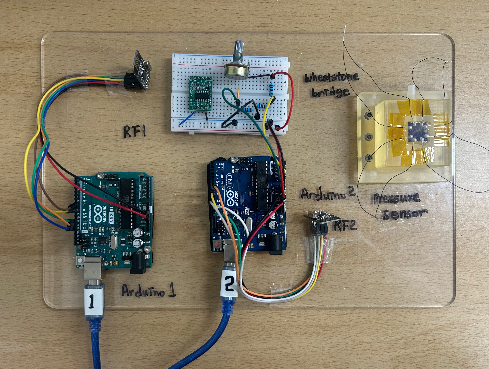
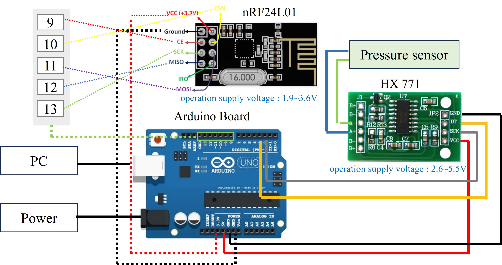

# Microsystem_team4

+ This project is part of the wireless system-related code from the 2024 Fall Semester PG course "Design and Fabrication of Microsystem" at Chonnam National University.

+ Team 4 : Liu Ke, Jeong Gowoon

## System Environment 

+ It was test in Window 10, Arduino IDE 2.3.3, Visual Studio Code, python 3.8.19.

+ The purpose of this project is to fabricate a piezoresistive pressure sensor using MEMS processes, measure its signal, and develop a wireless system to receive the transmitted signal.

+ The detailed system setup is shown in the figure below. 

## Prerequirement

+ For the realtime plotting in Python, PyQt5, matplotlib, pyserial is required.

+ To install the library, please try with

      pip install PyQt5 matplotlib pyserial

## Detailed Explanation

+ Please refer to the guides for Installing the [Arduino IDE](https://m.blog.naver.com/bpcode/221994096291) and Setting up [RF Communication](https://m.blog.naver.com/roboholic84/221139363425). (Korean)

+ send.ino and receive.ino are designed to run in the Arduino environment and require a one-time upload to the devices.

+ RealtimePlotting.py is used for real-time plotting of the received data. You can modify this script to include additional features such as custom plotting or pressure calculations.

+ The system includes three example measurements for applied pressures of 0, 50, 100, 150, 200, 250, and 300 kPa with a 1V input.
